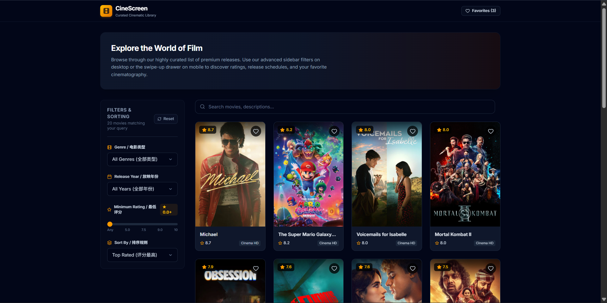
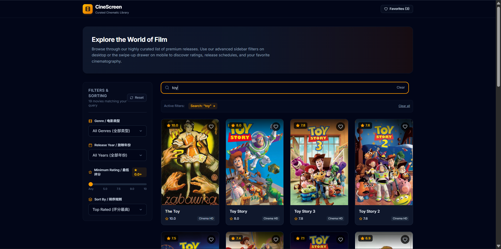

# 🎬 CineScreen — Movie Discovery & Filtering


> A fast, filterable movie discovery app powered by the TMDB API, built with React, TypeScript, and Redux Toolkit.




🔗 **Live Demo:** [Click Here](https://cinescreen-kappa-six.vercel.app)

---

## Description

**CineScreen** is a frontend application built with React 18 and TypeScript. It connects to the TMDB API to enable real-time movie discovery with multi-criteria filtering — search by keyword, filter by genre, release year, and rating, and save favourites locally.


## ✨ Features

- 🔍 Keyword search across movie titles and descriptions
- 🎛️ Multi-criteria filtering — genre, release year, minimum rating, and sort order
- ❤️ Favorites with local persistence via localStorage
- 🔗 Shareable filter URLs — active filter state is reflected in URL query params
- ♾️ Infinite scroll pagination
- 📱 Fully responsive — collapsible drawer on mobile, fixed sidebar on desktop

---

## 🛠 Tech Stack

| Category | Technology |
|----------|------------|
| Framework | React 18 + Vite |
| Language | TypeScript 5 |
| State Management | Redux Toolkit + RTK Query |
| UI Components | shadcn/ui + Tailwind CSS |
| Animations | Motion (Framer Motion) |
| Data Source | TMDB API |

---

## 🚀 Getting Started

### Prerequisites

- Node.js >= 18.x
- npm >= 9.x

### Installation

```bash
# 1. Clone the repo
git clone https://github.com/your-username/cinescreen.git
cd cinescreen

# 2. Install dependencies
npm install

# 3. Set up environment variables
cp .env.example .env.local
# Edit .env.local and fill in your TMDB credentials (see below)

# 4. Start the development server
npm run dev
```

### Environment Variables

```bash
# .env.local
VITE_TMDB_BASE_URL=https://api.themoviedb.org/3
VITE_TMDB_IMAGE_BASE=https://image.tmdb.org/t/p/w500
VITE_TMDB_API_READ_TOKEN=your_tmdb_read_access_token_here
```

> ⚠️ **Important:** TMDB authentication requires the **API Read Access Token** (a long JWT string beginning with `eyJ`), not the shorter API Key. The token is passed as a `Bearer` header in every request — never as a URL parameter. Get yours at [themoviedb.org/settings/api](https://www.themoviedb.org/settings/api) under **API Read Access Token**.

### Available Scripts

| Command | Description |
|---------|-------------|
| `npm run dev` | Start development server |
| `npm run build` | Production build |
| `npm run preview` | Preview production build locally |
| `npm run lint` | Run ESLint |

---

## 📁 Project Structure

```
src/
├── components/       # Pure UI components (no business logic)
│   ├── MediaCard/
│   ├── FilterPanel/
│   └── Pagination/
├── features/         # Business logic + Redux slices
│   ├── movies/       # moviesSlice, moviesApi, MoviesList
│   └── favorites/    # favoritesSlice
├── hooks/            # Custom hooks (filter sync, infinite scroll)
├── services/         # Data transformers (raw API → internal types)
├── store/            # Redux store configuration
├── types/            # TypeScript type definitions
└── lib/              # Utility functions and constants
```

---

## 🧩 Key Challenges & Solutions

### Challenge 1: TMDB Authentication — API Key vs. Read Access Token

**Problem:** The TMDB dashboard exposes two different credentials: an **API Key** and an **API Read Access Token**. Initial attempts used the API Key appended as a `?api_key=` URL parameter, which consistently returned a `401 Invalid API key` error.

**Investigation:** After reading the TMDB API documentation more carefully, the v3 API recommends the **Read Access Token** — a JWT string — passed via the `Authorization: Bearer <token>` request header rather than a query parameter.

**Solution:** Switched to the Read Access Token and configured RTK Query's `prepareHeaders` to inject it on every request:

```ts
baseQuery: fetchBaseQuery({
  baseUrl: import.meta.env.VITE_TMDB_BASE_URL,
  prepareHeaders: (headers) => {
    headers.set('Authorization', `Bearer ${import.meta.env.VITE_TMDB_API_READ_TOKEN}`);
    return headers;
  },
}),
```

This centralises authentication in one place, so no individual endpoint needs to handle it manually.

| Credential Type | Method | Result |
|----------------|--------|--------|
| API Key (`?api_key=`) | URL parameter | ❌ 401 Unauthorized |
| Read Access Token | `Authorization: Bearer` header | ✅ Authenticated |

---

### Challenge 2: TypeScript Type Mismatches Between API Response and Internal Models

**Problem:** The project defines two separate layers of types: raw API response types (e.g. `TMDBMovieRaw`) and internal consumption types (e.g. `Movie`). During development, several components were importing and using raw API field names directly — such as `poster_path` and `vote_average` — which caused type errors once the transformer layer was enforced.

**Solution:** Established a strict two-layer type contract. All raw TMDB response shapes are defined in `movie.types.ts` with the `TMDB` prefix, and all internal types use camelCase fields. The `dataTransformers.ts` service acts as the single boundary between the two layers — no component or hook is permitted to consume raw API types directly.

```ts
// Raw (API shape)         →   Internal (UI shape)
raw.poster_path            →   movie.posterUrl
raw.vote_average           →   movie.rating
raw.release_date           →   movie.releaseYear (number | null)
```

This made type errors immediately visible at the transformer boundary rather than scattered across the codebase.

---

## 📄 License

MIT